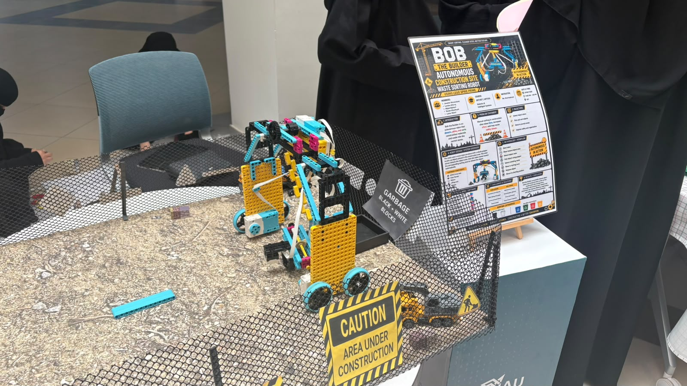
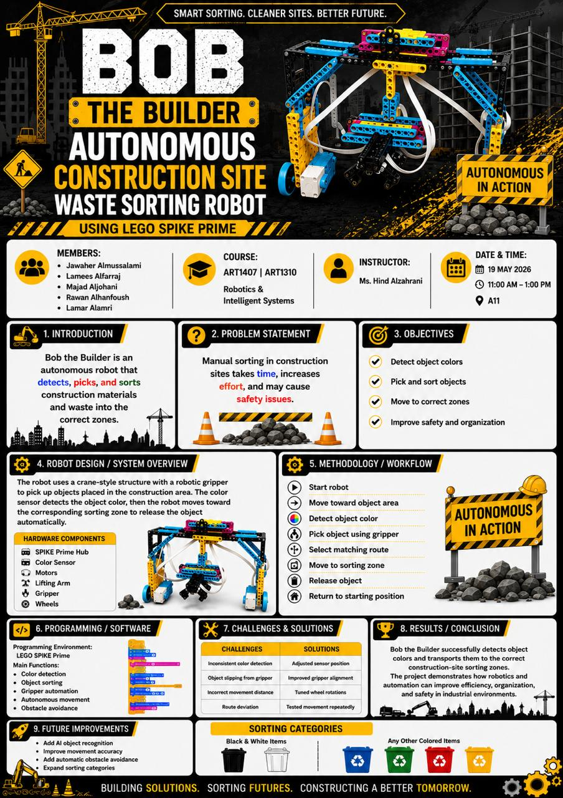

<p align="center">
  
</p>

# 🤖 Bob the Builder – Autonomous Construction Site Waste Sorting Robot

## Overview

Bob the Builder is an autonomous construction-site waste sorting robot developed using LEGO SPIKE Prime.
The robot detects construction materials based on their colors, picks them up using a robotic gripper, and automatically places them into the correct sorting area. The project was developed as part of the Robotics and Intelligent Systems course and presented during the College of Computer Science and Information Technology exhibition.

---

## Project Poster

<p align="center">
  
</p>

---

## Features

- Autonomous color detection
- Robotic object pickup
- Automatic waste sorting
- Color sensor integration
- Motorized robotic arm
- LEGO SPIKE Prime programming

---

## Technologies Used

- LEGO SPIKE Prime
- Visual Block Programming
- Color Sensor
- Motors
- Robotic Gripper

---

## Repository Structure

```text
Code/
Demo/
Images/
Poster/
README.md
```

---

## Project Gallery

The repository includes:

- Robot source code
- Demonstration videos
- Project photos
- Exhibition poster

---

## Author

**Rawan Alhanfoush**

B.Sc. Artificial Intelligence Student  
